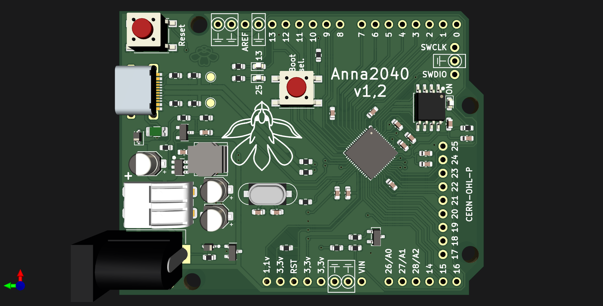

# Anna 2040

Similar feature set to the Raspberry pi pico in the classic uno shape.

USB-C

2MB flash memory

all IO pins available

proper analog voltage reference

3,8-32V buck converter with:

lossless reverse polarity protection on the power inputs

data line ESD protection

USB power fuse

LEDs on both pin 13 and 25 as on the uno and pico
